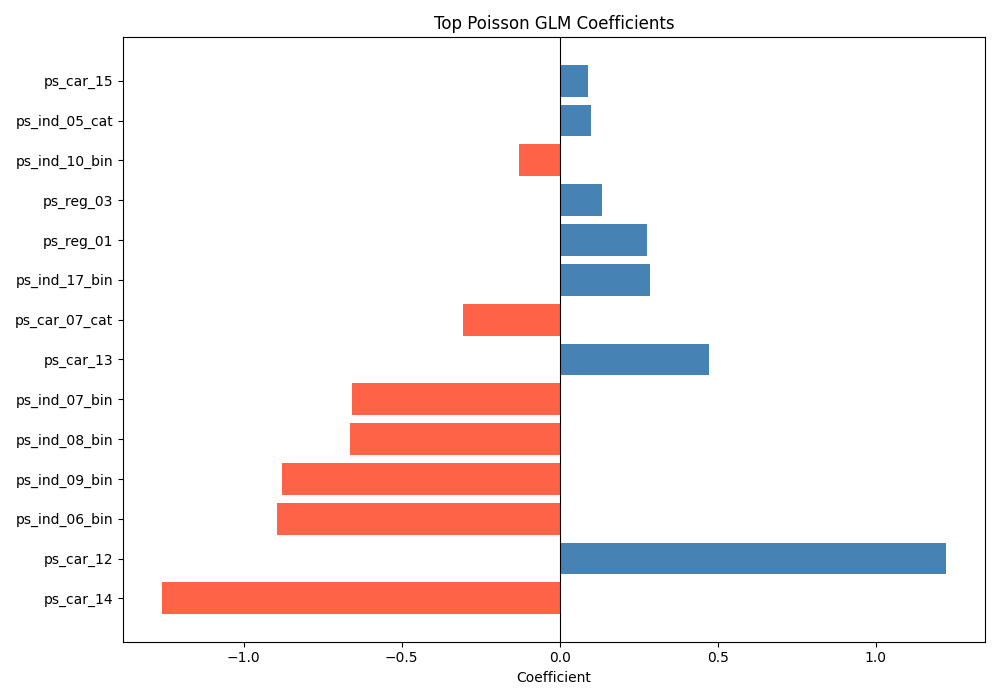

# Auto Insurance Claim Prediction using GLMs

An end-to-end data science project predicting auto insurance claim probability using Generalized Linear Models (GLMs). The project demonstrates a full pipeline across three tools — SQL, Python, and R — and includes both a logistic regression and a Poisson GLM, reflecting real P&C actuarial modeling workflows.

---

## Project Overview

Insurance companies need to identify high-risk customers to price policies accurately. This project builds and compares two GLMs on the Porto Seguro Safe Driver Prediction dataset from Kaggle, covering 595,212 customers and 59 features.

**Key results:**
- Logistic GLM (R): AUC 0.622 (in-sample)
- Poisson GLM (Python): AUC 0.623 (out-of-sample, held-out test set)
- Near-identical AUC across both models and in/out-of-sample confirms findings are robust and the model generalizes well

---

## Tools & Technologies

- **SQL (DuckDB)** — Data loading and feature exploration
- **Python (Pandas)** — EDA, data cleaning, Poisson GLM, train/test validation
- **R (glm, ggplot2, pROC)** — Logistic GLM, coefficient visualization, ROC curve

---

## Project Structure

```
glm-project/
├── sql/              # DuckDB queries for data exploration
├── data/             # Raw and cleaned datasets (not tracked by git)
├── python/           # Jupyter notebooks for EDA, cleaning, and Poisson GLM
├── r/                # R scripts for logistic GLM and diagnostics
└── report/           # Output plots and findings
```

---

## Workflow

### 1. SQL — Data Exploration
- Loaded raw CSV into DuckDB
- Explored claim rates across key variables
- Finding: customers with `ps_ind_17_bin = 1` had a 5.52% claim rate vs 3.39% for others — a meaningful risk differentiator

### 2. Python — EDA & Cleaning
- Identified severe class imbalance: 96% no claim, 4% claim
- Replaced `-1` missing value encoding with `NaN`
- Dropped two columns with >40% missing data (`ps_car_03_cat`, `ps_car_05_cat`)
- Dropped near-zero signal `ps_calc_*` columns based on correlation analysis
- Final dataset: 595,212 rows × 36 columns

### 3. R — Logistic GLM
- Fit logistic regression using `glm()` with `family = binomial(link = "logit")`
- Interpreted coefficients as log-odds
- Evaluated with ROC curve — AUC: 0.622

### 4. Python — Poisson GLM with Train/Test Validation
- Fit Poisson GLM using `statsmodels` with `family = Poisson()` and log link
- Proper 80/20 train/test split — model trained only on training data
- Out-of-sample AUC: 0.623, confirming the model generalizes well to unseen data
- Consistent findings across both GLM families validates robustness of key predictors

---

## Key Findings

- **`ps_car_12` (~1.27)** — strongest positive predictor of claims across both models, likely a vehicle characteristic
- **`ps_car_14` (~-1.34)** — strongest protective factor against claims across both models
- **`ps_ind_06/07/08/09_bin`** — strong negative predictors in the Poisson model, reflecting driver profile risk segments
- **`ps_ind_17_bin` (0.30)** — customers with this characteristic are ~30% more likely to file a claim
- Findings are consistent across logistic and Poisson GLMs, suggesting the signal is real and not model-dependent

---

## Limitations

- The logistic regression in R was evaluated in-sample (no train/test split) — AUC may be slightly optimistic
- The Porto Seguro dataset is fully anonymized, so predictors cannot be mapped to real-world variables
- The dataset only contains a binary claim indicator, not actual claim counts or amounts — a true frequency/severity split was not possible with this data
- Class imbalance (96/4) was not corrected for 

---

## Dataset

[Porto Seguro Safe Driver Prediction](https://www.kaggle.com/c/porto-seguro-safe-driver-prediction/data)

---

## How to Run

1. Download `train.csv` from Kaggle and place it in `data/`
2. Run the Jupyter notebook in `python/` for EDA, cleaning, and Poisson GLM — generates `train_clean.csv`
3. Run the R script in `r/` for logistic GLM and diagnostic plots

### Python dependencies
```bash
pip install pandas seaborn matplotlib duckdb jupyter statsmodels scikit-learn numpy
```

### R dependencies
```r
install.packages(c("ggplot2", "pROC", "dplyr"))
```

---

## Results




